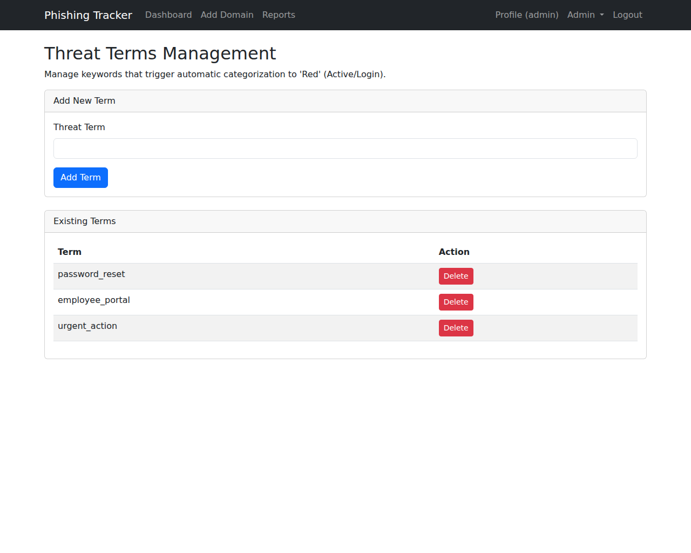
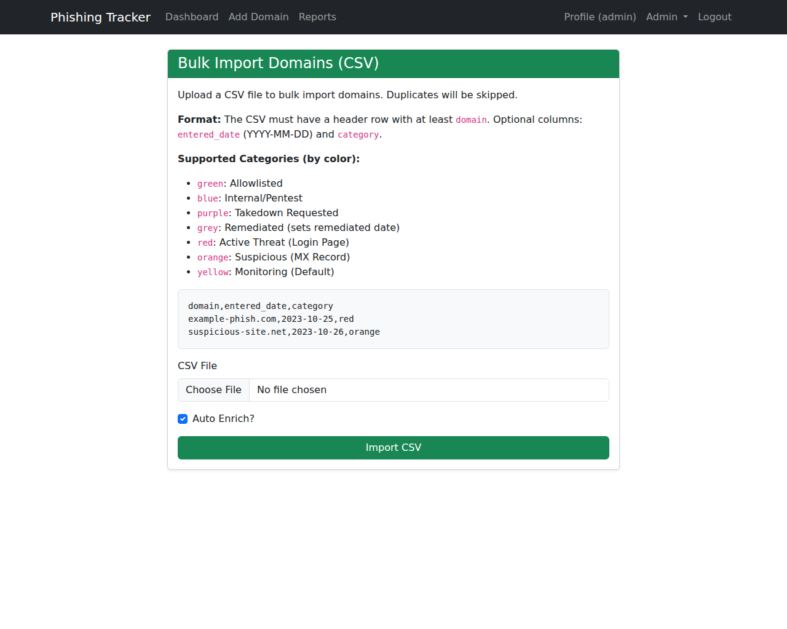

# Administrator Documentation

## Initial Setup
The application comes with an initial administrator account.
**Username:** `admin`
**Initial Password:** `admin` (You will be forced to change this upon first login).

## Creating Users
1. Log in as an administrator.
2. Click "Create User" in the navigation bar.
3. Enter a username and an initial password.
4. The user will be created, and an initial API Key pair (Access Key and Secret) will be generated.
   - **Note:** You must securely transmit the initial credentials to the user. The user will be forced to change their password upon first login.
   - **Note:** The API Secret is shown only once. If lost, the user can regenerate it from their profile.

## Domain Management
As an administrator (and user), you can:
- **Add Domains:** Manually add domains to track.
- **Enrich Domains:** Trigger enrichment (Whois, URLScan, etc.).
- **Update Status:** Manually set status (e.g., Allowlisted, Takedown Requested).
- **Delete Domains:** Remove domains from the system.
- **Reports:** Generate CSV reports based on date range and status.

### Bulk Dashboard Actions
On the main dashboard, you can select multiple domains using the checkboxes and perform bulk actions:
- **Enrich/Refresh:** Triggers enrichment for all selected domains.
- **Delete Selected:** Deletes all selected domains.

## Email Ingestion & Analysis
The system allows uploading `.eml` and `.msg` files for automated analysis.
1. **Upload:** Users can upload files via the "Add Domain/Phish Extract" page.
2. **Analysis:** The system extracts headers, body, and indicators (IPs, URLs, Domains).
3. **Enrichment:** Extracted indicators are checked against VirusTotal (if configured).
4. **Correlation:** Evidence is correlated with known Phishing Domains.

### Evidence Storage (Admin Only)
Navigate to **Admin > Evidence Storage** to view all submitted emails.
- View metadata (Submitter, Date, Filename).
- View Correlation matches.
- **PDF Report:** Download a detailed PDF analysis report for each submission.
- **Refresh Correlations:** Trigger a background task to re-scan all evidence against the latest domain database.

## Threat Terms Management
1. Navigate to **Admin > Threat Terms**.
2. **Add Term:** Enter a keyword (e.g., "CompanyXYZ", "HR Portal") that implies a phishing attempt against your organization.
3. **Delete Term:** Remove obsolete terms.



These terms are used by the automated scheduler and enrichment process to scan domain content. If a match is found on a non-allowlisted domain, it may be flagged as 'Red'.

## Automated Scheduler & Background Worker
The system runs background tasks for domain checks and email processing.
To run the background worker for email processing and reports:
```bash
flask run-worker
```
The scheduler handles periodic domain checks and a daily **Correlation Refresh**.

Logs are stored in `logs/syslog.log` relative to the application root.

## Advanced Data Management
These features are available in the **Admin** dropdown menu.

### Bulk Import
You can bulk import domains using a CSV file.
1. Navigate to **Admin > Import CSV**.
2. Upload a CSV file. The file must have a header row with at least a `domain` column. An optional `entered_date` (YYYY-MM-DD) column is also supported.
3. Duplicates will be automatically skipped.



### Database Backup & Restore
1. Navigate to **Admin > Backup/Restore**.
2. **Backup:** Click "Download Backup" to get a full JSON dump of Users, API Keys, Domains, **Threat Terms**, **Evidence**, and **Correlations**.
3. **Restore:** Upload a previously generated backup JSON file.
   - **WARNING:** This will **delete all existing data** in the database and replace it with the backup content. This action cannot be undone.

**Note:** Backup and Restore operations can also be performed programmatically via the API (see `API.md`).

## Correlation Engine & Threat Detection
The system includes an advanced correlation engine that analyzes domains for shared infrastructure:
- **Fingerprinting:** Collects IP, ASN, Registrar, Favicon Hash (MMH3), JARM Hash, and HTML Artifacts (scripts/CSS).
- **Correlation:** Automatically identifies related sites based on matching pivots (e.g., same IP, same Favicon, overlapping artifacts).
- **Blue Domain Rule:** If any tracked domain links to an image hosted on an 'Internal/Pentest' (Blue) domain, it is automatically flagged as 'Confirmed Phish' (Red) with a note added to the record.
- **Evidence Correlation:** Matches extracted indicators from emails to monitored Phishing Domains.

## Configuration
Set the following environment variable to enable VirusTotal integration:
- `VIRUSTOTAL_API_KEY`: Your VirusTotal API Key.
