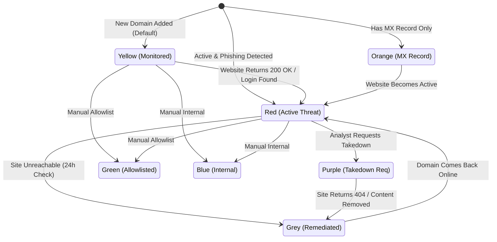

# System Architecture

## Introduction

The **Phishing Domain Tracker** is a specialized security application designed to help organizations track, monitor, and remediate phishing domains targeting their brand. It serves as a central repository for intelligence, offering automated lifecycle monitoring, threat detection, and seamless integration with external security vendors for enrichment and takedown.

This document outlines the high-level architecture, data flows, and security mechanisms of the system, intended for stakeholders and security analysts.

## System Overview

The application is built as a monolithic web application using the **Flask** framework (Python). It combines a server-side rendered user interface with a background job scheduler for automated monitoring.

### High-Level Components

```mermaid
graph TD
    User[Security Analyst] -->|HTTPS| UI[Web Dashboard / Flask App]
    API_Client[External Scripts] -->|HTTPS / JSON| API[REST API]

    subgraph "Application Server"
        UI
        API
        Scheduler[Background Scheduler (APScheduler)]
        Logic[Business Logic & Threat Detection]
    end

    subgraph "Data Storage"
        DB[(SQLite Database)]
    end

    subgraph "External Integrations"
        Whois[WhoisXML API]
        Urlscan[Urlscan.io]
        Google[Google Web Risk]
        URLhaus[URLhaus API]
    end

    UI --> Logic
    API --> Logic
    Scheduler --> Logic
    Logic --> DB
    Logic --> Whois
    Logic --> Urlscan
    Logic --> Google
    Logic --> URLhaus
```

*   **Web Dashboard:** The primary interface for analysts to add domains, view details, and manage threat statuses.
*   **REST API:** Provides programmatic access for bulk operations, backups, and external integrations.
*   **Background Scheduler:** Periodically checks domains to update their status automatically based on reachability and content analysis.
*   **SQLite Database:** Stores all domain data, user credentials, and configuration locally.

---

## Domain Threat Lifecycle

The core value of the application is its "Color-Coded" threat status system. Domains transition between statuses based on automated checks and manual analyst actions.

### State Diagram



### Status Definitions

1.  **<span style="color:red">Red (Active Threat)</span>**: The domain is online and hosting phishing content (login page or threat keywords detected). Immediate action is required.
2.  **<span style="color:orange">Orange (MX Record)</span>**: The domain has valid MX (Mail Exchange) records but no active web threat. It may be used for email-based phishing.
3.  **<span style="color:purple">Purple (Takedown Requested)</span>**: An analyst has reported the domain to a registrar or hosting provider. The system checks frequently (every 6 hours) to verify if it goes offline.
4.  **<span style="color:gray">Grey (Remediated)</span>**: The threat is neutralized (domain offline, parked, or 404). The system monitors these monthly to ensure they don't reactivate.
5.  **<span style="color:gold">Yellow (Monitored)</span>**: Default state for new domains that are not yet active or have no MX records. Checked weekly.
6.  **<span style="color:green">Green (Allowlisted)</span>**: Manually marked as safe/authorized. Excluded from threat alerts.
7.  **<span style="color:blue">Blue (Internal/Pentest)</span>**: Internal infrastructure or authorized penetration testing domains.

---

## Core Workflows

### 1. Ingestion & Enrichment
When a domain is added (via UI or API):
1.  **Sanitization:** Whitespace is stripped.
2.  **Enrichment:**
    *   **WhoisXML:** Fetches registrar, registration date, and creation data.
    *   **Urlscan.io:** Scans the URL to generate a screenshot and identify hosting/IP information.
    *   **MX Check:** Queries DNS for MX records.
3.  **Initial Assessment:** The domain is immediately assigned a threat status (e.g., Red if a login page is found, Orange if MX exists).

### 2. Automated Monitoring (The Scheduler)
The application runs several background jobs to keep data fresh:

| Frequency | Target Group | Action |
| :--- | :--- | :--- |
| **Every 6 Hours** | **Purple** | Checks if the site is down (404/Connection Refused). Moves to **Grey** if verified down. |
| **Every 24 Hours** | **Red** | Checks if the site is still active. Moves to **Grey** if unreachable. Updates IP address. |
| **Every 24 Hours** | **Orange** | Checks for changes in MX records. Logs any modifications. |
| **Weekly** | **Yellow** | Checks if the site has become active (200 OK) or hosts a login page. Moves to **Red** if positive. |
| **Monthly** | **Grey** | "Lazarus Check" - Checks if a remediated site is back online. Moves to **Red** if active. |

### 3. Reporting & Takedown
Analysts can use the "Report Phishing" feature on the domain details page. This triggers API calls to:
*   **Google Web Risk:** Submits the URL to Google's blocklist.
*   **URLhaus:** Submits the URL to the URLhaus threat intelligence database.

*Note: Reporting requires a valid API key configuration and a password re-verification step for security.*

---

## Data Model

The database schema is designed for simplicity using SQLite.

*   **PhishingDomain**: The central entity containing domain metadata (`domain_name`, `registrar`, `ip_address`), status flags (`is_active`, `has_login_page`, `manual_status`), and timestamps (`date_entered`, `date_remediated`).
*   **User**: Application users. Includes fields for authentication (`password_hash`), security (`failed_login_attempts`, `password_expired`), and role (`is_admin`).
*   **APIKey**: Linked to users. Stores the `access_key` and a hashed version of the `secret_key` (`secret_hash`) for secure programmatic access.
*   **ThreatTerm**: A dynamic list of keywords (e.g., "password", "login", "urgent") used by the scanner to detect phishing content on analyzed pages.

---

## Security Architecture

### Authentication
*   **Web UI:** Uses **Flask-Login** with session cookies. Cookies are configured with `HttpOnly` and `SameSite=Lax` (and `Secure` in production) to prevent XSS and CSRF attacks. Passwords are hashed using **Bcrypt**.
*   **API:** Uses a custom header-based authentication scheme:
    *   `X-API-Key`: Public identifier.
    *   `X-API-Secret`: Secret credential (hashed in DB, never stored in plain text).

### Access Control
*   **Role-Based Access Control (RBAC):**
    *   **Admin:** Can manage users, view system logs, perform backups/restores, and manage threat terms.
    *   **Analyst (Standard User):** Can add/edit domains, trigger scans, and view reports.

### Security Features
*   **CSRF Protection:** Enabled globally via **Flask-WTF** (exempting API routes).
*   **Input Sanitization:** Domain names are stripped of whitespace; output is auto-escaped by Jinja2 templates.
*   **Audit Logging:** Critical actions (status changes, logins, remediations) are logged to `logs/syslog.log` in a structured format compatible with SIEM tools.
