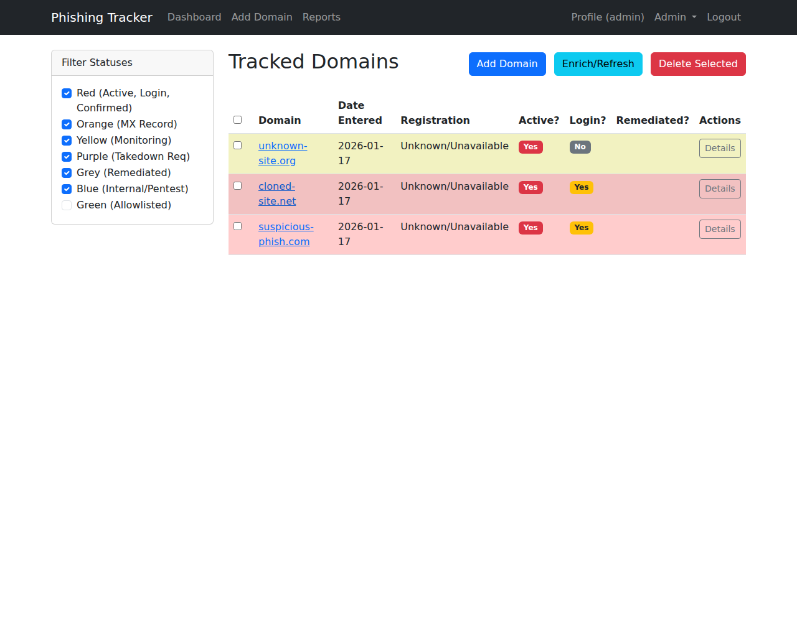
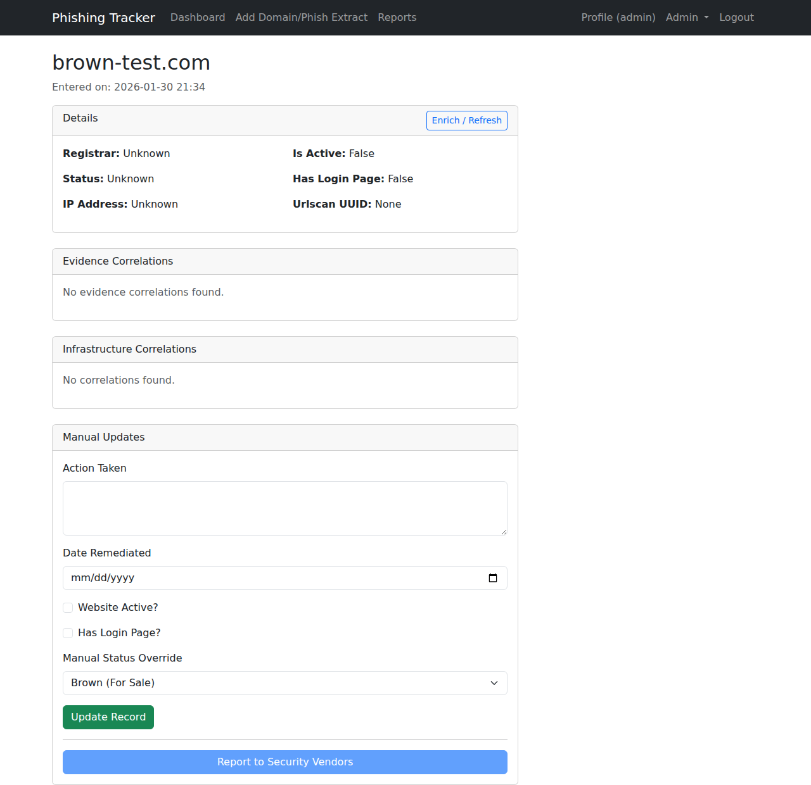

# User Documentation

## Getting Started
1. Obtain your credentials from your administrator.
2. Navigate to the login page.
3. Enter your username and initial password.
4. You will be prompted to change your password immediately.

## Profile Management
- Access your profile by clicking your username in the navigation bar.
- **API Keys:** You can view your API Access Key here. The Secret Key is hidden for security.
- **Regenerate API Key:** If you lose your secret key or need to rotate credentials, click "Regenerate API Key". **Warning:** This invalidates the old key immediately. The new Secret Key will be shown once—copy it immediately.

## Dashboard Usage
- **Dashboard:** View the list of tracked domains. Rows are color-coded based on threat status.
- **Add Domain:** Submit a new domain for tracking.
- **Reports:** Export domain data to CSV.

## Adding Domains & Phishing Emails
Navigate to **Add Domain/Phish Extract** to submit data.
- **Add Domain:** Enter a domain name to begin tracking.
- **Upload Email:** Upload a `.eml` or `.msg` file. The system will automatically:
    - Parse headers and body.
    - Extract indicators (IPs, URLs, Domains).
    - Check indicators against VirusTotal.
    - Correlate indicators with existing tracked domains.

## Reporting Phishing
- Navigate to the **Domain Details** page for a specific domain.
- In the "Manual Updates" section, click **Report to Security Vendors**.
- Enter your password to confirm the action.
- The system will attempt to report the domain to configured security vendors (e.g., Google Web Risk, URLhaus, VirusTotal).
- A status report will be displayed indicating success or failure for each vendor.

## Correlation & Analysis
The **Domain Details** page includes an "Infrastructure Correlations" section.
- **Related Domains:** Displays a list of other tracked domains that share infrastructure (IP, ASN, Favicon, JARM, or Artifacts).
- **Evidence Correlations:** Displays email files that contained indicators matching this domain. You can download a PDF report of the email analysis.
- **Confidence Score:** A score indicating the strength of the relationship. Higher scores suggest cloned or related infrastructure.
- **Blue Domain Alerts:** If a domain is found hosting images from your internal (Blue) domains, it will be automatically flagged as **Confirmed Phish** and marked in the domain notes.

